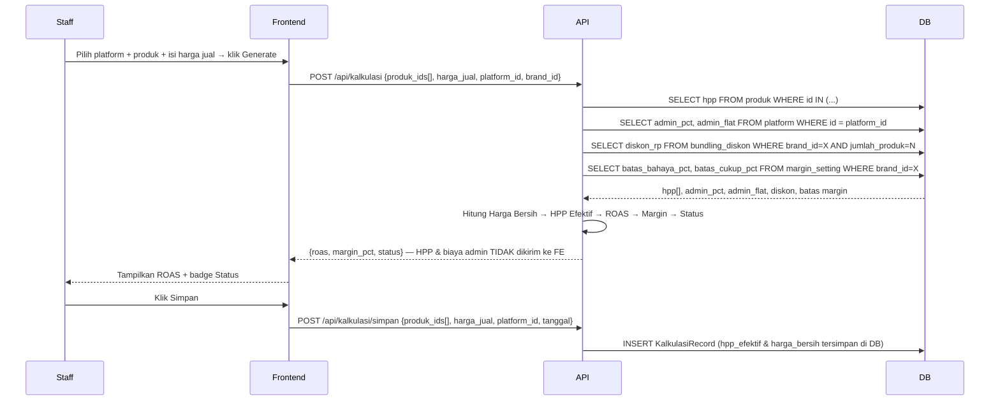
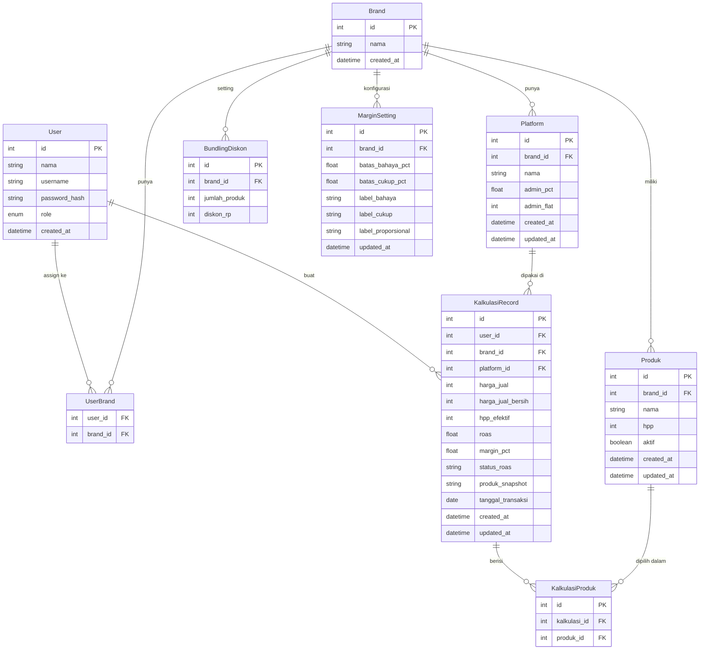

# PRD — ROAS Calculator Zaneva (nama app: **ROAS20X**)

## 1. Overview

ROAS20X adalah aplikasi web internal untuk brand-brand di bawah holding ZANEVA. Staff menginput harga jual + memilih platform → sistem otomatis hitung ROAS bersih (setelah dipotong biaya admin platform) → tampilkan status sebagai **patokan keputusan iklan** (lanjut atau matikan), tanpa staff pernah melihat HPP. Owner dan Manager mengelola HPP, setting margin minimum, biaya admin platform, diskon bundling, dan user management di area khusus **Private Room**. Status ROAS terdiri dari 3 level: **Bahaya / Cukup / Proporsional**.

---

## 2. Requirements

- **Aksesibilitas:** Web (responsive, mobile-friendly)
- **Pengguna:** 3 role — OWNER, MANAGER, STAFF
- **Auth:** iron-session (session-based login)
- **Data Input:** Manual via form + Import CSV/XLSX (produk HPP oleh Owner/Manager; harga jual oleh Staff)
- **Export:** Template CSV/XLSX bisa didownload (panduan format import)
- **Constraint khusus:**
  - HPP **tidak boleh terlihat** oleh STAFF dalam kondisi apapun — termasuk response API
  - MANAGER hanya bisa kelola brand yang di-assign oleh Owner
  - MANAGER tidak bisa akses User Management
  - Setting margin, HPP, platform, diskon bundling, user management → hanya di **Private Room**
  - Nama aplikasi di UI: **ROAS20X**

---

## 3. Core Features

### 3.1 Authentication *(Must-have)*
- Login dengan username + password
- Session-based auth (iron-session)
- Redirect otomatis sesuai role setelah login:
  - STAFF → Dashboard User
  - OWNER/MANAGER → Private Room (default tab: Produk)

### 3.2 Private Room — Master Produk & HPP *(Must-have — OWNER & MANAGER only)*
- CRUD produk per brand: nama produk, HPP (sudah include kemasan dll)
- HPP hanya visible di Private Room (OWNER & MANAGER brand tersebut)
- **Import massal via CSV/XLSX:**
  - Kolom wajib: `nama_produk`, `hpp`
  - Kolom opsional: `aktif` (default: true)
  - Mode **upsert**: nama sama di brand yang sama → update HPP lama
  - Baris error (HPP kosong / bukan angka) → di-skip + tampil sebagai warning
  - Preview tabel (valid = hijau, skip = merah + keterangan) sebelum konfirmasi simpan
  - Notifikasi: "X produk berhasil diimport, Y baris di-skip"
- **Download template CSV/XLSX** dengan header yang benar

### 3.3 Private Room — Setting Platform & Biaya Admin *(Must-have — OWNER & MANAGER only)*
- 1 brand bisa punya **banyak platform** (Shopee, TikTok, Lazada, dll)
- Per platform, Owner/Manager setting:
  - **Nama platform** (bebas diisi, misal "Shopee", "TikTok Shop")
  - **Admin %** — persentase yang dipotong dari harga jual kotor
  - **Admin Flat (Rp)** — biaya tetap yang dipotong setelah potongan %
- CRUD platform per brand
- Contoh:

| Brand | Platform | Admin % | Admin Flat |
|-------|----------|---------|-----------|
| Zaneva | Shopee | 6% | Rp 2.000 |
| Zaneva | TikTok | 5% | Rp 0 |
| Be.Syari | Shopee | 6% | Rp 1.500 |

### 3.4 Private Room — Setting Margin & Status ROAS *(Must-have — OWNER & MANAGER only)*
- Setting per brand: **2 batas margin %** yang membagi 3 zona status
- Margin dihitung dari **Harga Jual Bersih** (sudah dipotong biaya admin platform)

| Status | Kondisi Margin | ROAS Minimum (dihitung sistem) |
|--------|---------------|-------------------------------|
| **Bahaya** | Margin < batas_bahaya % | < `1 / (1 - batas_bahaya/100)` |
| **Cukup** | batas_bahaya % ≤ Margin < batas_cukup % | antara keduanya |
| **Proporsional** | Margin ≥ batas_cukup % | ≥ `1 / (1 - batas_cukup/100)` |

- Contoh setting Zaneva: batas_bahaya = 5%, batas_cukup = 10%
- Label status bisa diubah teksnya per brand (misal "Bahaya" → "Stop Iklan")
- Tampil preview ROAS minimum hasil konversi saat Owner/Manager input margin

### 3.5 Private Room — Diskon Bundling *(Must-have — OWNER & MANAGER only)*
- Setting per brand, diskon berbasis **jumlah produk** dalam 1 kalkulasi
- Diskon **mengurangi HPP Total** (bukan harga jual)
  - Pilih 1 produk → diskon Rp X (default: Rp 0)
  - Pilih 2 produk → diskon Rp Y (default: Rp 5.000)
  - Pilih 3 produk → diskon Rp Z (default: Rp 10.000)
- Formula: `HPP Efektif = Σ HPP produk terpilih − Diskon (sesuai jumlah produk)`

### 3.6 Private Room — User Management *(Must-have — OWNER only)*
- CRUD user: nama, username, password, role, assign brand (bisa multi-brand)
- MANAGER tidak bisa akses menu ini

### 3.7 Dashboard User — Tabel Referensi Produk *(Must-have — semua role)*
- Searchbox: ketik nama produk → filter realtime semua produk di brand yang di-assign
- Tabel kolom: **Nama Produk | Platform Terakhir | ROAS Terakhir | Status Terakhir | Tanggal**
  - Data "Terakhir" = dari record kalkulasi terakhir yang disimpan untuk produk tersebut
  - Jika belum ada record → tampil "-"
- **HPP tidak ditampilkan**
- Fungsi utama: **referensi keputusan iklan** — staff lihat status → putuskan lanjut/matikan
- Klik baris produk → langsung masuk ke form Input Harga Jual dengan produk sudah terpilih

### 3.8 Input Harga Jual — Kalkulator & Record *(Must-have — semua role)*

**Form kalkulasi:**
- Brand switcher (jika multi-brand)
- **Pilih Platform** (dropdown: daftar platform yang sudah diset Owner/Manager untuk brand ini)
- Searchbox pilih Produk 1 (wajib), Produk 2 (opsional), Produk 3 (opsional)
- Isi **Harga Jual Total** (satu angka untuk semua produk yang dipilih — harga kotor di platform)
- Klik **"Generate ROAS"** → sistem hitung di server (semua formula di §4)
- Tampilkan ke staff: **angka ROAS + badge status** (HPP dan biaya admin tidak ditampilkan)
- Klik **"Simpan"** → record masuk ke database

**List record tersimpan:**
- Tabel: Tanggal | Platform | Produk | Harga Jual | ROAS | Status
- Bisa diedit dan dihapus oleh user yang bersangkutan

**Import massal via CSV/XLSX:**
- Kolom wajib: `produk_1`, `harga_jual`, `platform`
- Kolom opsional: `produk_2`, `produk_3`, `tanggal` (default: hari ini)
- Server parsing + kalkulasi ROAS per baris (HPP tidak pernah kembali ke frontend)
- Preview: tabel Platform | Produk | Harga Jual | ROAS | Status per baris
- Baris error di-highlight merah + keterangan alasan
- Klik "Simpan Semua" → semua baris valid masuk ke DB
- **Download template CSV/XLSX**

### 3.9 Rekap Record — OWNER & MANAGER *(Nice-to-have — MVP+1)*
- OWNER: lihat semua record semua brand + semua user
- MANAGER: lihat record di brand yang di-assign
- Filter: per brand, per user, per platform, per periode
- Kolom: Tanggal | User | Platform | Produk | Harga Jual | ROAS | Status
- HPP tidak ditampilkan di view ini
- Export rekap ke CSV

---

## 4. Formula Kalkulasi (Hardcoded — tidak boleh diubah)

```
Step 1 — Harga Jual Bersih (potong biaya admin platform):
  Harga Jual Bersih = (Harga Jual × (1 − Admin%)) − Admin Flat

Step 2 — HPP Efektif (potong diskon bundling):
  HPP Efektif = Σ HPP produk terpilih − Diskon Bundling (sesuai jumlah produk)

Step 3 — ROAS Aktual:
  ROAS Aktual = Harga Jual Bersih / HPP Efektif

Step 4 — Margin Aktual:
  Margin Aktual (%) = (1 − HPP Efektif / Harga Jual Bersih) × 100

Step 5 — Konversi setting margin → ROAS minimum (referensi di server):
  ROAS Minimum = 1 / (1 − margin% / 100)

Step 6 — Penentuan Status:
  if Margin Aktual < batas_bahaya%  → Status = BAHAYA
  if Margin Aktual < batas_cukup%   → Status = CUKUP
  else                               → Status = PROPORSIONAL
```

**Contoh end-to-end:**
- HPP Produk A = 50.000, HPP Produk B = 60.000
- Pilih 2 produk → Diskon Bundling = 5.000
- HPP Efektif = (50.000 + 60.000) − 5.000 = **105.000**
- Harga Jual kotor = 130.000, Platform = Shopee (Admin 6%, Flat 2.000)
- Harga Jual Bersih = (130.000 × 94%) − 2.000 = 122.200 − 2.000 = **120.200**
- ROAS Aktual = 120.200 / 105.000 = **1.145**
- Margin Aktual = (1 − 105.000 / 120.200) × 100 = **12.65%**
- Setting brand: batas_bahaya = 5%, batas_cukup = 10%
- Status = **Proporsional** ✅ (12.65% > 10%)

---

## 5. User Flow

### Flow STAFF — Generate ROAS
1. Login → Dashboard User (tabel produk + status ROAS terakhir)
2. Searchbox → ketik produk → lihat status sebagai referensi keputusan iklan
3. Klik produk / buka halaman Input Harga Jual → produk otomatis terpilih
4. Pilih Platform → isi Harga Jual Total → klik "Generate ROAS"
5. Tampil: ROAS = 1.14 | **Proporsional** ✅
6. Klik "Simpan" → record tersimpan, muncul di list bawah
7. Dashboard otomatis update status terakhir produk tersebut

### Flow OWNER/MANAGER — Setup Private Room
1. Login → masuk Private Room
2. Tab **Produk**: CRUD / import produk + HPP per brand
3. Tab **Platform**: tambah/edit/hapus platform per brand, isi Admin% dan Admin Flat
4. Tab **Setting Margin**: isi batas_bahaya% dan batas_cukup% → sistem preview ROAS minimum
5. Tab **Diskon Bundling**: set nilai diskon per jumlah produk
6. Tab **User Management** (OWNER only): tambah/edit/hapus user, assign brand

### Flow OWNER/MANAGER — Import Produk
1. Private Room → Tab Produk → klik "Import CSV/XLSX"
2. Download template → isi `nama_produk`, `hpp`, opsional `aktif`
3. Upload → preview (hijau = valid, merah = skip + alasan)
4. Klik "Konfirmasi Import" → simpan ke DB (upsert)

### Flow STAFF — Import Harga Jual
1. Input Harga Jual → klik "Import CSV/XLSX"
2. Download template → isi `produk_1`, `harga_jual`, `platform`, opsional `produk_2`, `produk_3`, `tanggal`
3. Upload → server kalkulasi → preview Platform | Produk | Harga Jual | ROAS | Status
4. Baris error merah + keterangan → klik "Simpan Semua"

### Edge Cases
- Pilih 0 produk → tombol "Generate ROAS" disabled
- Platform belum dipilih → tombol "Generate ROAS" disabled
- Harga Jual = 0 atau kosong → validasi, tidak bisa generate
- HPP produk = 0 atau belum diset → produk tidak muncul di pilihan staff
- Harga Jual Bersih < HPP Efektif → ROAS < 1, Margin negatif → status **Bahaya** (rugi)
- Brand belum punya platform → staff tidak bisa generate (tampil pesan "Hubungi Manager")
- MarginSetting brand belum diisi → kalkulasi tetap jalan, status = "-" (unconfigured)
- Import Staff: nama produk tidak ditemukan → baris di-skip + warning
- Import Staff: nama platform tidak ditemukan di brand → baris di-skip + warning
- Import file bukan CSV/XLSX → tolak + pesan error
- Import file > 5MB → tolak + pesan error
- MANAGER akses brand lain → 403
- STAFF akses Private Room → 403

---

## 6. Architecture



---

## 7. Database Schema



| Tabel | Fungsi |
|-------|--------|
| User | Data login & role |
| Brand | Master brand (Zaneva, Be.Syari, Oberbe, Muslimah Swimwear) |
| UserBrand | Relasi many-to-many user ↔ brand |
| Produk | Master produk per brand + HPP |
| Platform | Daftar platform per brand + biaya admin (% dan flat) |
| BundlingDiskon | Setting diskon per jumlah produk per brand |
| MarginSetting | Batas margin % + label status per brand |
| KalkulasiRecord | History kalkulasi (hpp_efektif & harga_bersih di DB, tidak dikirim ke FE untuk STAFF) |
| KalkulasiProduk | Produk apa saja yang masuk dalam 1 kalkulasi |

---

## 8. Design & Technical Constraints

### Tech Stack
- **Frontend:** Next.js 15 (App Router)
- **Backend:** API Routes (Next.js)
- **ORM:** Prisma
- **Database:** PostgreSQL
- **Auth:** iron-session
- **Deploy:** EasyPanel (Docker, `output: 'standalone'`)
- **Styling:** TailwindCSS
- **File parsing:** `xlsx` (SheetJS) — parse CSV & XLSX di server side
- **File upload:** Next.js native FormData handling

### UI System
- Font Sans: `Geist Mono, ui-monospace, monospace`
- Font Mono: `JetBrains Mono, monospace`
- Mode: Dark (deep navy) — ikuti design system ELYASR
- Badge status:
  - Bahaya → Merah
  - Cukup → Oranye/Kuning
  - Proporsional → Hijau

### Naming Convention
- Label UI: Bahasa Indonesia
- Fungsi/variabel/komponen: camelCase / PascalCase
- API routes: kebab-case
- Enum role: `OWNER`, `MANAGER`, `STAFF`
- Enum status: `BAHAYA`, `CUKUP`, `PROPORSIONAL`

### Business Logic Hardcoded (tidak boleh diubah tanpa konfirmasi Rizky)
1. **HPP dan biaya admin tidak boleh dikirim ke client jika role = STAFF** — API hanya return `{roas, margin_pct, status}`
2. **harga_jual_bersih dan hpp_efektif disimpan di DB** (untuk audit) tapi tidak pernah ada di response FE untuk STAFF
3. **Urutan potongan biaya admin:** `% dulu, baru flat` → `(Harga Jual × (1 − Admin%)) − Admin Flat`
4. **Margin dihitung dari Harga Jual Bersih**, bukan Harga Jual kotor: `(1 − HPP Efektif / Harga Jual Bersih) × 100`
5. **ROAS dihitung dari Harga Jual Bersih**: `Harga Jual Bersih / HPP Efektif`
6. **Diskon bundling mengurangi HPP Efektif**, bukan harga jual
7. **Jumlah produk maks 3 per kalkulasi**
8. **MANAGER tidak bisa akses User Management dan tidak bisa akses brand lain**
9. **Import CSV/XLSX: semua kalkulasi di server** — frontend hanya terima hasil ROAS + status
10. **Import produk: mode upsert** — nama sama di brand yang sama → update HPP
11. **Import harga jual Staff: produk & platform dicocokkan by nama** — case-insensitive, trim whitespace; tidak ketemu → skip + warning
12. **tanggal_transaksi default = hari ini** jika tidak diisi

### Halaman per Role
| Halaman | OWNER | MANAGER | STAFF |
|---------|-------|---------|-------|
| Dashboard User (tabel referensi + status terakhir) | ✅ | ✅ | ✅ |
| Input Harga Jual + Import CSV/XLSX | ✅ | ✅ | ✅ |
| Private Room — Produk & HPP + Import | ✅ | ✅ (brand assign) | ❌ |
| Private Room — Platform & Biaya Admin | ✅ | ✅ (brand assign) | ❌ |
| Private Room — Setting Margin | ✅ | ✅ (brand assign) | ❌ |
| Private Room — Diskon Bundling | ✅ | ✅ (brand assign) | ❌ |
| Private Room — User Management | ✅ | ❌ | ❌ |
| Rekap Record (semua user) | ✅ (all brand) | ✅ (brand assign) | ❌ |

### Brand Awal (seed data)
- Zaneva
- Be.Syari
- Oberbe
- Muslimah Swimwear

### Constraint Lain
- Multi-brand: 1 user bisa di-assign ke beberapa brand → brand switcher di navbar
- Antigravity rule: Step 1 prompt ke developer selalu → *"Folder sudah di-extract manual oleh user, JANGAN extract ZIP. Langsung cd ke folder, lalu npm install."*
- Nama app di UI: **ROAS20X**
