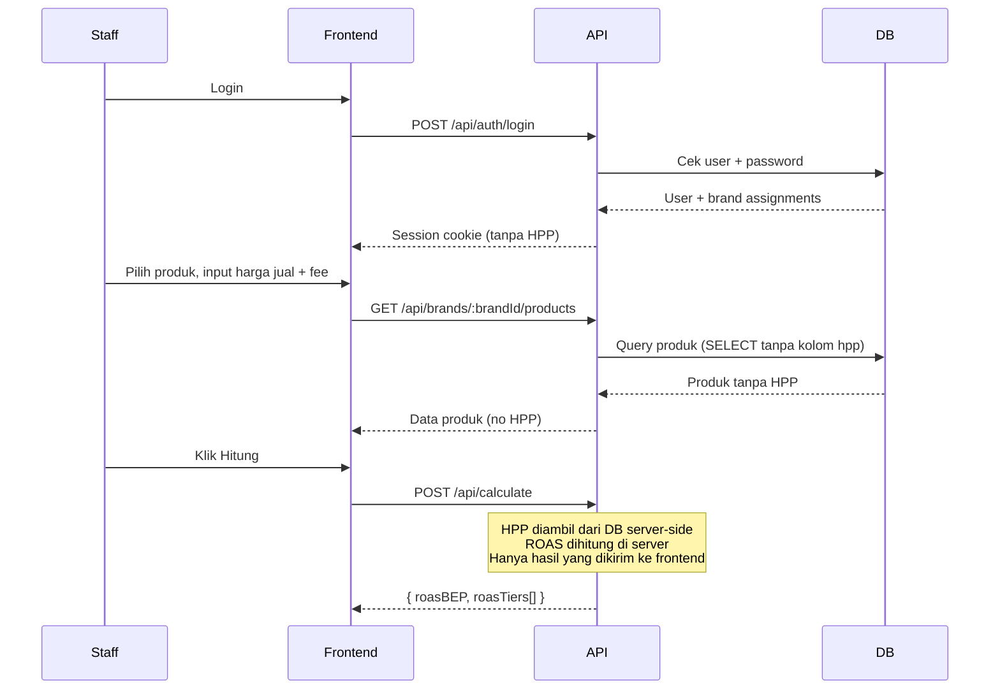
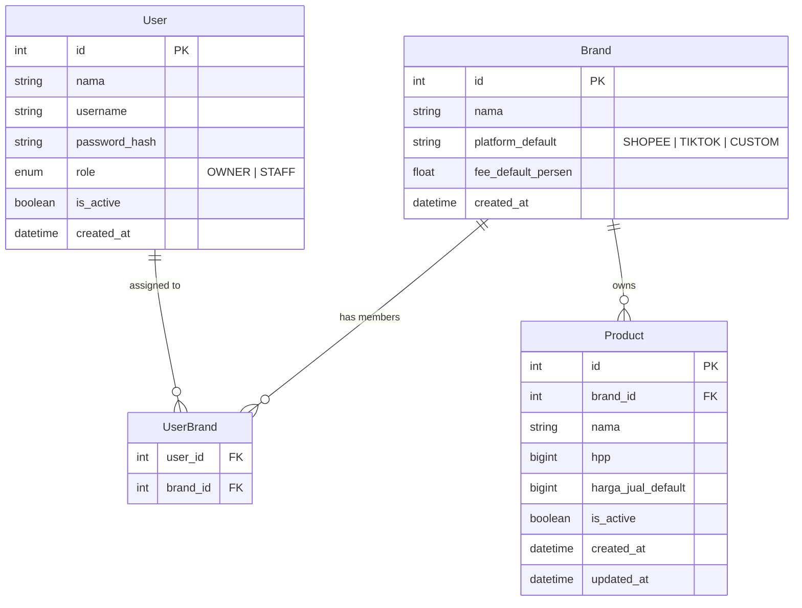

# PRD — ROAS Calculator

## 1. Overview

ROAS Calculator adalah internal tool untuk membantu tim marketing dan owner menghitung **minimum ROAS yang harus dicapai** agar iklan marketplace menguntungkan. Aplikasi ini digunakan oleh semua brand di bawah holding Rizky (ZANEVA group + ELYASR), dengan database dan data produk yang **terpisah per brand**. HPP produk bersifat rahasia — hanya OWNER yang bisa melihat dan mengatur, sementara staff hanya melihat hasil kalkulasi ROAS minimal tanpa tahu HPP aslinya.

---

## 2. Requirements

- **Aksesibilitas:** Web app — diakses dari berbagai device (laptop, HP) via browser
- **Pengguna:** 2 role — OWNER (Rizky) dan STAFF (tim marketing per brand)
- **Auth:** iron-session (username + password)
- **Data Input:** Manual input via form
- **Export:** Tidak ada di MVP
- **Constraint khusus:**
  - HPP **tidak boleh tampil** di UI manapun yang bisa diakses STAFF
  - Satu user bisa di-assign ke **lebih dari satu brand**
  - Data produk **terpisah per brand** — staff brand A tidak bisa lihat data brand B
  - Fee platform **bisa diset berbeda** per brand (bukan hardcoded)

---

## 3. Core Features

### 3.1 Auth & Session — MUST HAVE
- Login dengan username + password
- Session dengan iron-session
- Redirect berdasarkan role setelah login

### 3.2 Brand Management — MUST HAVE (OWNER only)
- CRUD brand (nama brand, platform default: Shopee/TikTok/Custom)
- Set fee default per brand (%) — bisa dioverride saat kalkulasi
- Assign/unassign user ke brand

### 3.3 User Management — MUST HAVE (OWNER only)
- CRUD user (nama, username, password, role: OWNER/STAFF)
- Assign user ke satu atau lebih brand

### 3.4 Product Management — MUST HAVE
- **OWNER:** CRUD produk per brand — nama, HPP (tersimpan terenkripsi/hidden), harga jual default
- **STAFF:** Hanya bisa lihat nama produk dan harga jual default. HPP **tidak pernah dikirim ke frontend**

### 3.5 ROAS Calculator — MUST HAVE (core feature)
- Pilih brand → pilih produk (atau input produk baru sementara)
- Input:
  - Harga Jual (pre-filled dari default, bisa diubah)
  - Fee Platform % (pre-filled dari default brand, bisa diubah)
  - Target Margin % (bisa diisi bebas, bisa tambah beberapa tier)
- Output:
  - ROAS Minimal BEP
  - ROAS Minimal per tier margin yang diinput
  - Net per unit (tanpa tampilkan HPP) — opsional tampilkan ke STAFF
- Input ROAS Aktual (dari Shopee/TikTok dashboard) → status indikator hijau/kuning/merah

### 3.6 Multi-Produk Comparison — MUST HAVE
- Bisa tambah produk A + B + C dalam satu sesi kalkulasi
- Tampil side-by-side: nama produk, harga jual, ROAS minimal per tier
- Berguna untuk compare campaign antar SKU

### 3.7 Reverse Simulator — NICE TO HAVE
- Input ROAS aktual + estimasi ad spend → estimasi profit/rugi per Rp 1 juta ad spend
- Berguna untuk pitching budget ke Rizky

---

## 4. User Flow

### Flow: Staff Kalkulasi ROAS

1. Staff login → diarahkan ke dashboard brand yang di-assign
2. Pilih brand (jika punya akses > 1 brand)
3. Pilih produk dari list (produk sudah diisi oleh OWNER)
4. Harga jual ter-prefill, fee platform ter-prefill — staff bisa ubah untuk simulasi
5. Input target margin % sesuai kebutuhan (bisa tambah beberapa tier)
6. Klik **Hitung** → muncul tabel ROAS Minimal per tier
7. Opsional: input ROAS aktual → lihat status indikator (✅ Profit / ⚠️ Tipis / ❌ Rugi)
8. Opsional: tambah produk lain → compare side-by-side

### Flow: Owner Setup Produk

1. OWNER login → akses semua brand
2. Buka Brand Management → pilih brand
3. Tambah/edit produk: nama, HPP (asli atau yang sudah dinaikkan), harga jual default, fee default
4. Assign staff ke brand

### Edge Cases

- Staff coba akses brand yang tidak di-assign → redirect + pesan error
- Fee diinput 0% → warning validasi
- HPP > Harga Jual → warning (produk tidak bisa untung)
- Harga Jual diubah staff sampai dibawah HPP → OWNER tidak tahu, tapi output ROAS akan sangat tinggi (sistem tetap hitung)
- Session expired → redirect ke login

---

## 5. Architecture



---

## 6. Database Schema



| Tabel | Fungsi |
|-------|--------|
| User | Akun login semua user |
| Brand | Master data brand (Zaneva, Be.Syari, dll) |
| UserBrand | Relasi many-to-many user ↔ brand |
| Product | Produk per brand, menyimpan HPP (tidak pernah di-expose ke STAFF) |

---

## 7. Design & Technical Constraints

### Tech Stack
- **Frontend:** Next.js 15 (App Router)
- **Backend:** API Routes (Next.js)
- **ORM:** Prisma
- **Database:** PostgreSQL
- **Auth:** iron-session
- **Deploy:** EasyPanel VPS (Tencent Cloud Jakarta)

### UI System
- Font Sans: `Geist Mono, ui-monospace, monospace`
- Font Mono: `JetBrains Mono, monospace`
- Mode: **Dark (deep navy)**
- Accent: merah/oranye untuk warning ROAS di bawah BEP, hijau untuk aman

### Naming Convention
- Label UI & field DB bisnis: Bahasa Indonesia
- Fungsi, variabel, komponen React: Bahasa Inggris / camelCase / PascalCase
- API routes: kebab-case
- Enum: UPPER_SNAKE_CASE

### Business Logic Hardcoded
```
Net Revenue per unit = Harga Jual × (1 - fee_persen / 100)
Gross Profit per unit = Net Revenue - HPP
ROAS BEP = Harga Jual / Gross Profit per unit
ROAS Target(M%) = Harga Jual / (Gross Profit - Harga Jual × M / 100)
```
- HPP **tidak boleh dikirim** ke frontend dalam kondisi apapun
- Kalkulasi ROAS dilakukan **server-side** — frontend hanya menerima hasil akhir
- Semua nilai mata uang disimpan sebagai **integer (rupiah penuh)**, tanpa desimal
- Format tampilan: `Rp 1.500.000`

### Constraint Lain
- Staff hanya bisa query produk dari brand yang ada di UserBrand miliknya (enforced di API layer)
- OWNER bisa akses semua brand tanpa perlu di-assign
- Password disimpan dengan bcrypt
- Tidak ada fitur self-register — semua user dibuat oleh OWNER

---

## 8. Scope MVP vs Next Version

### MVP (v1)
- ✅ Auth + session
- ✅ Brand & user management (OWNER)
- ✅ Product management dengan HPP hidden
- ✅ ROAS Calculator single & multi-produk
- ✅ Status indikator ROAS aktual vs minimal

### Next Version (v2)
- ⬜ Reverse simulator (ad spend → estimasi profit)
- ⬜ History kalkulasi tersimpan per user
- ⬜ Export hasil kalkulasi ke PDF
- ⬜ Notifikasi jika ROAS campaign di bawah BEP
